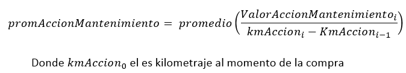

## Generalidades del proyecto

El objetivo global del proyecto del curso es facilitar la aplicación de las 4 prácticas de ingeniería de software vistas a lo largo del curso: 
* Historias de usuario, 
* Manejo de control de versiones y flujos de trabajo, 
* Desarrollo basado en pruebas,
* Integración continua. 

El proyecto es pequeño, su alcance ya está ha definido y documentado a través de un enunciado. Para desarrollar el proyecto se conformarán equipos de dos estudiantes. El proceso de desarrollo es incremental, en cada semana se avanza en el desarrollo y se incorporarán las prácticas que se van estudiando en el curso.

Las semanas 2 y 3, se dedican al entendimiento del problema y al alistamiento del sitio para la documentación del proyecto y del repositorio para el código.

**Semana 2**

      - Se construye un modelo conceptual usando un diagrama de clases en UML para ayudar en el entendimiento del problema y se construye un glosario de términos.
      - Se identifican los requerimientos y se contruye un listado de historias de usuario.
  
**Semana 3**

      - Se configura el espacio de documentación del proyecto en GitHub, el tablero de actividades para el seguimiento del proyecto  y el repositorio en sistema de control de versiones GIT donde se gestionará el código del proyecto.
      - Se realiza el detalle de las historias de usuario.
  
En las semanas 4, 5, 6 y 7 se desarrollan las historias en dos iteraciones. En cada semana se van integrando nuevas prácticas.

**Iteración 1** 
  
    Semana 4
      - Se realiza el diseño detallado de la aplicación (lógica e interfaz), se definen las firmas de los métodos. 
      - Se define el flujo de trabajo inicial.
  
    Semana 5:
      - Desarrollo de historias de usuario utilizando desarrollo dirigido por pruebas (Test Driven Development).

**Iteración 2**

    Semana 6:
      - Desarrollo de historias de usuario utilizando TDD y pruebas unitarias.
      - Generación automática de datos prueba.
      - Definición de un flujo de trabajo GitFlow
  
    Semana 7:  
      - Desarrollo de historias de usuario utilizando TDD y pruebas unitarias.
      - Generación automática de datos prueba.
      - Se define un flujo de trabajo en una herramienta de integración contínua que permite integrar el proyecto de forma tal que funcione en todo momento. Esta verificación se hace de manera automatizada y ejecuta las pruebas definidas, reportando el resultado.

**Semana 8**
      - Se realiza el cierre del proyecto
      - Se realiza una demostración de la solución
      - Se hace una retrospectiva del trabajo realizado. 

El proyecto se comienza a desarrollar a partir de la **semana 2** del curso. Las parejas se conforman durante la semana 2 y el trabajo en grupo inicia en la semana 3.

## Enunciado

La empresa SoftOne lo ha contratado para desarrollar una aplicación llamada “auto-perfecto” que permitirá a un usuario gestionar todo lo relacionado con sus automóviles. Las personas que poseen un automóvil tienen que estar pendientes de muchos mantenimientos que deben realizarle, como impuestos, gasolina, reparaciones, entre otros, y a veces les queda difícil saber qué deben hacer con sus automóviles y llevar las cuentas de lo que deben realizar para tenerlos en perfectas condiciones. Para iniciar el contrato, la empresa lo cita a una reunión para especificar sus necesidades, como se comenta a continuación.

Al iniciar la aplicación el usuario verá una pantalla principal, donde podrá ver el logo, la descripción de “auto-perfecto” y el listado de automóviles que tiene registrados. El usuario verá, por cada vehículo, la opción de editar su información, ver las acciones que tiene registradas, venderlo, o de borrar la información del vehículo, siempre que no tenga acciones. En esta pantalla también verá una opción para agregar un nuevo vehículo, donde podrá registrar la marca, placa, modelo, kilometraje que tenía cuando lo compró, el color, cilindraje y el tipo de combustible que usa. Cuando se vende el automóvil, se debe registrar el precio de venta y el kilometraje que tenía al momento de entregarlo.

El usuario también tendrá en la pantalla principal un acceso a una lista de mantenimientos que podrá realizar sobre cualquiera de los automóviles que tiene registrados en “auto-perfecto”, y desde esta lista podrá crear un mantenimiento con su nombre y descripción, editar los mantenimientos existentes, o borrarlos si los automóviles registrados no las usan.

Cuando el usuario abre la información de un automóvil, verá una pantalla con las acciones que ha realizado sobre el automóvil, mostrando por cada una el nombre del mantenimiento al que corresponde, el kilometraje que tenía el automóvil cuando la realizó, la fecha y el costo de la acción. Adicionalmente, en esta pantalla tendrá las opciones para crear, editar y borrar las acciones sobre un automóvil, así como un botón que le mostrará un resumen de cuántos gastos le ha generado el automóvil, cuanto le ha costado por cada año que lo ha tenido y cuánto le cuesta mover el automóvil un kilómetro a partir de todos los gastos que ha tenido en el último año.

**Método para calcular el costo de utilizar el automóvil un kilómetro**

Para calcular el valor de un kilómetro de un automóvil, se debe hacer lo siguiente:

1.	Calcular el promedio de lo que cuesta un kilómetro para las acciones de un mismo mantenimiento así:

2.	Calcular el promedio del valor del kilómetro de las acciones de mantenimiento:

## Tecnologías para el desarrollo 

La aplicación que se va a desarrollar es una aplicación muy sencilla, mono usuario y con interfaz de escritorio. 

Las tecnologías que se utilizarán para desarrollar el proyecto son: Python como lenguaje de programación, GIT para el control de versiones, SQLite y SQLAlchemy para la base de datos. Para el desarrollo del proyecto se cuenta con la siguiente infraestructura:

| Elemento                  | Herramienta |
| ------------------------- | ----------- |
| Base de datos             | SQLite     |
| Framework ORM para Python | SQLAlchemy  |
| Lenguaje de programación  | Python      |
| Manejador de versiones    | Git         |
| Repositorio remoto        | Github      |
| Manejador de IC           | Github      |
| Kanban de planeación      | Github      |

