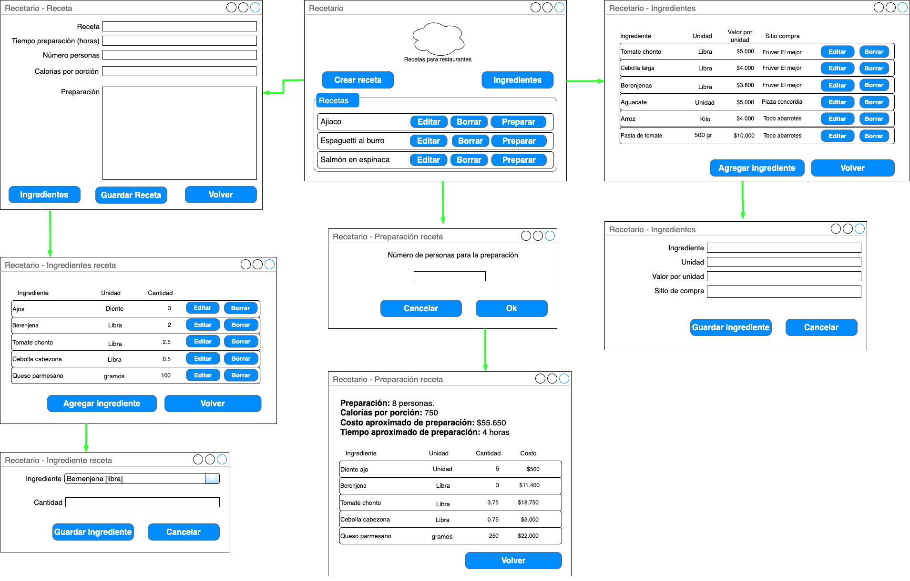
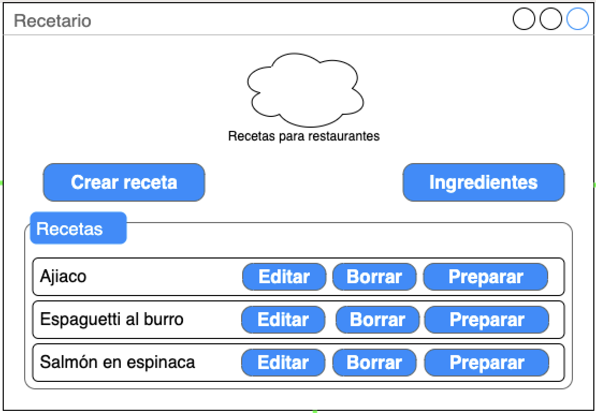
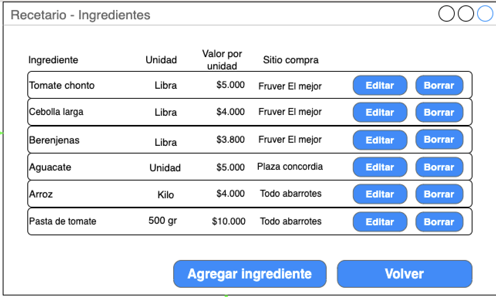
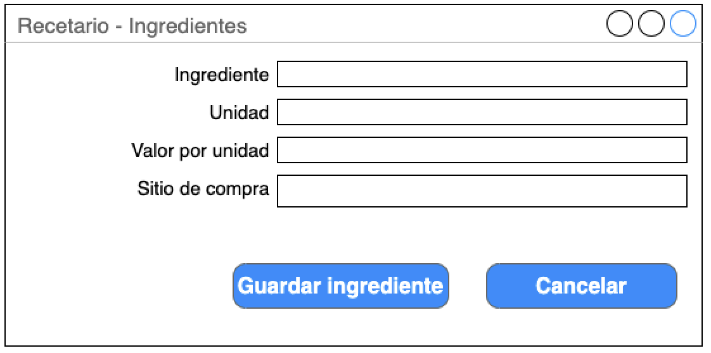
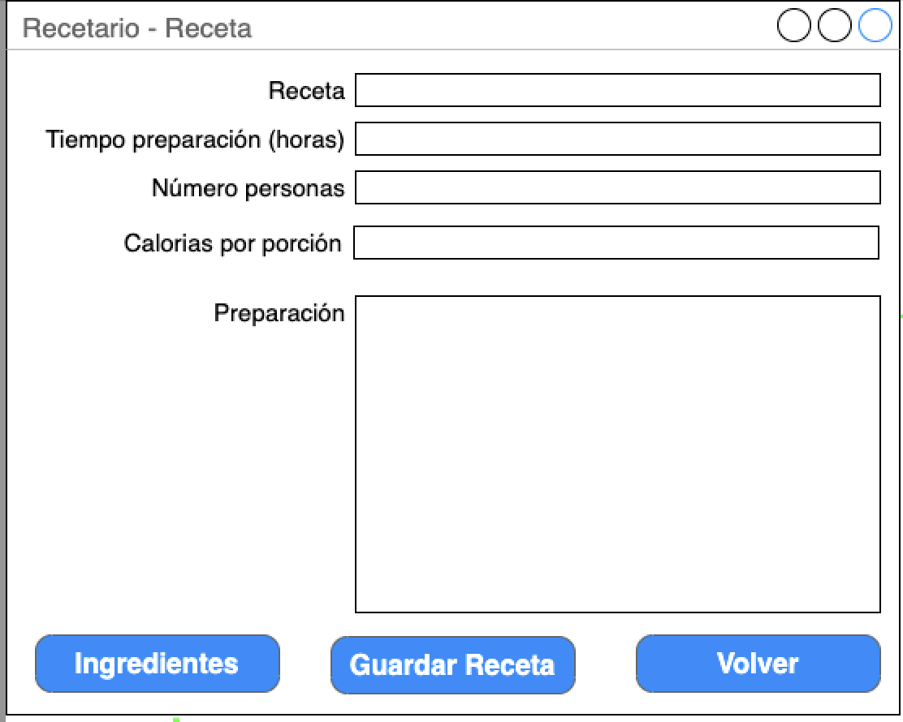
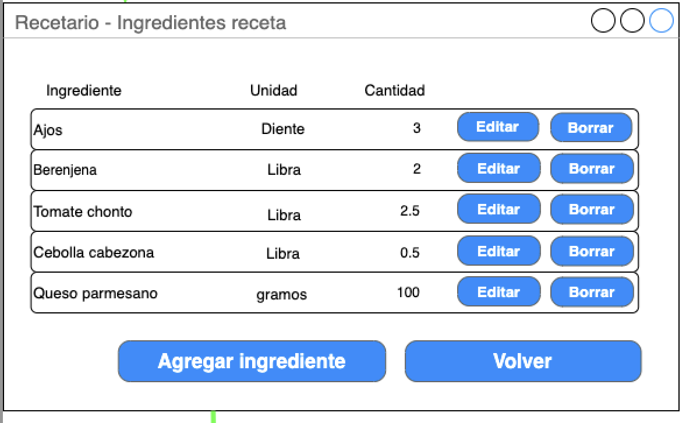
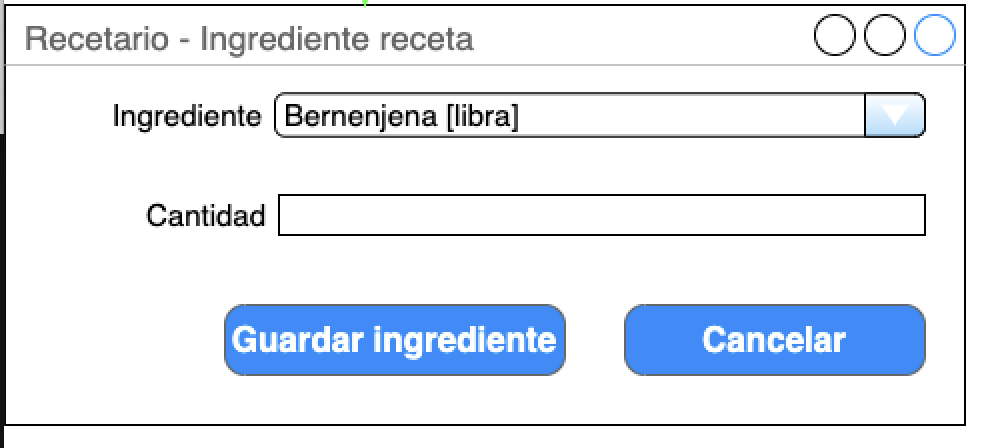
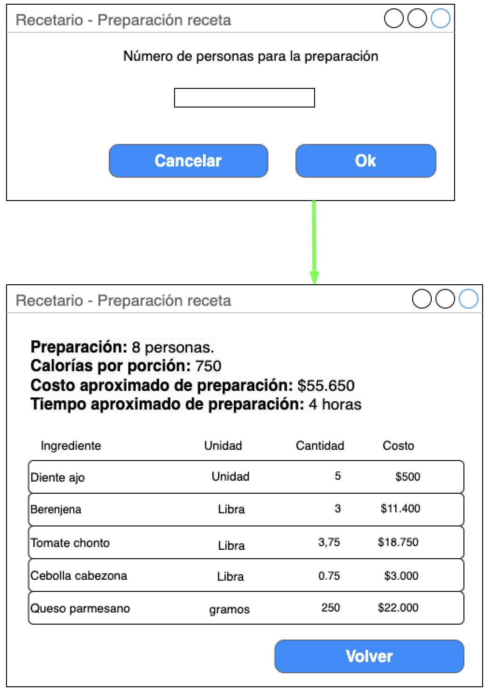

 

## Árbol de navegación y diseño de pantallas

 

### Ventana Principal - Lista de recetas

Esta es la pantalla principal de la aplicación. Desde acá se pueden ver todas las recetas que se tienen en Recetario y se puede acceder a las demás funcionalidades de la aplicación (íngredientes, preparación).

 

#### Ingredientes
El botón de "Crear receta" permite ver la lista de ingredientes disponibles:

 A partir de este listado se puede crear/editar una receta o eliminarla: 
 

La eliminación de ejercicios se hace a través de los botones correspondientes.

#### Recetas
El boton Crear resceta de la Ventana principal abre la ventana para crear una receta:

Esta ventanta sirve también para editar los datos de una receta.

#### Ingredientes receta

Con el botón ingredientes e la pantalla crear receta se abre la ventana que listas todos los ingredientes que tiene una receta.

Desde esta ventana, con el botón agregar ingrediente se puede adicionar un nuevo ingrediente para la receta.

#### Preparación receta

El botón Preparar de la ventana de Principal muestra la información para la preparación de una receta.

 

