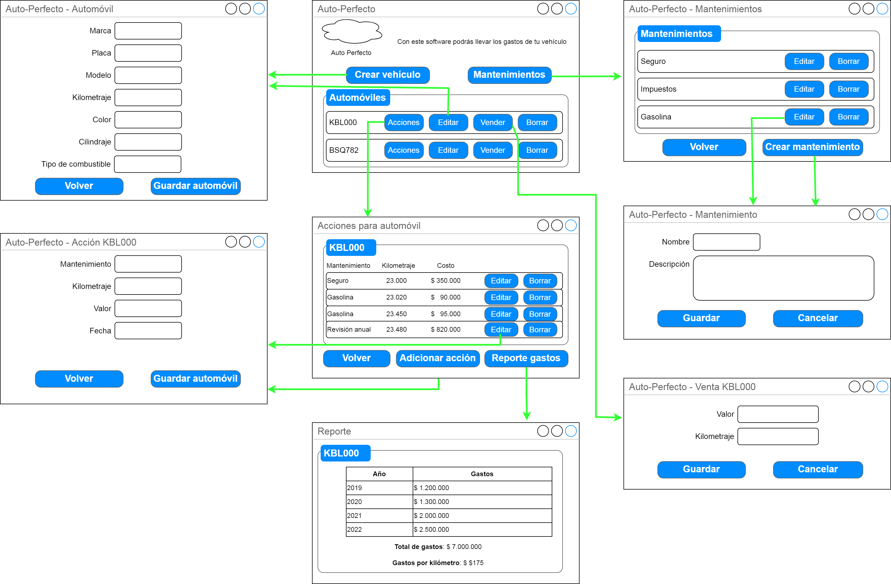
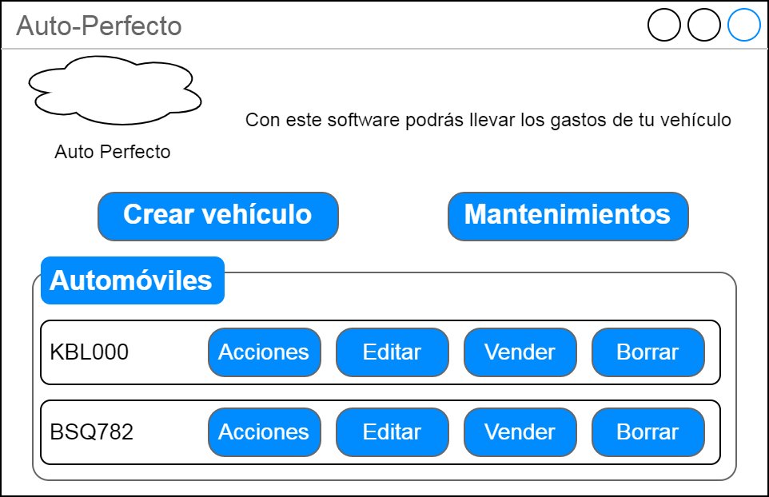
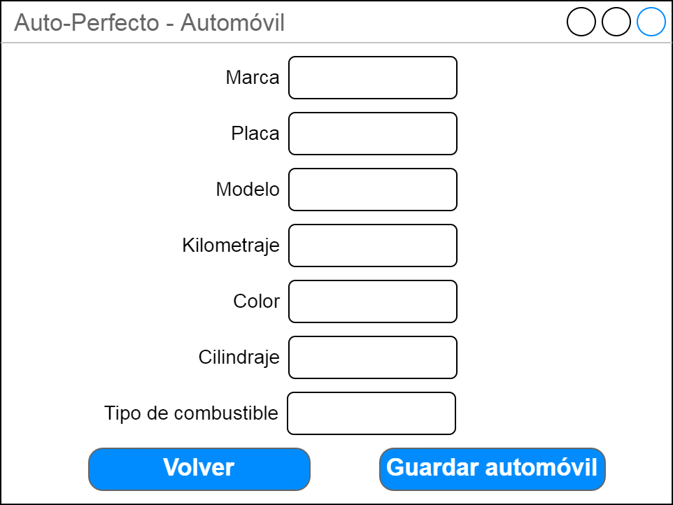
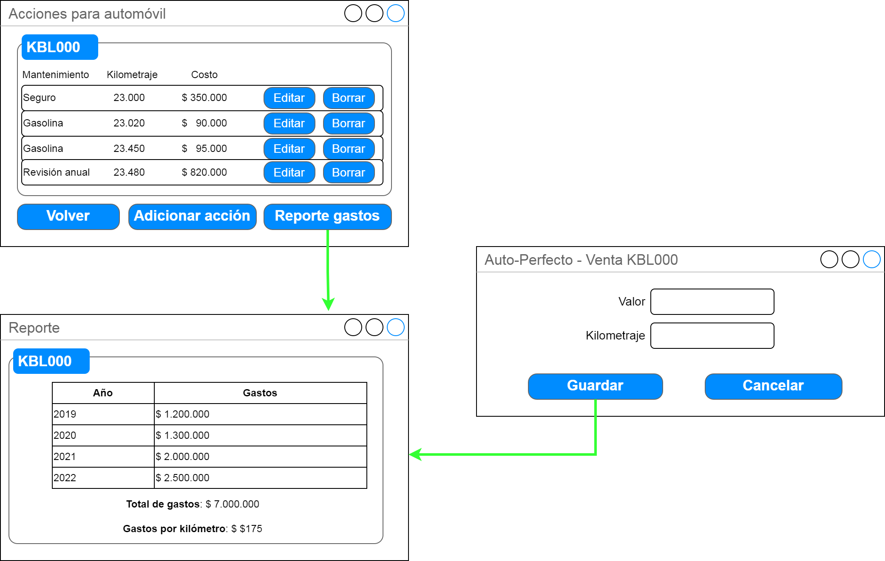
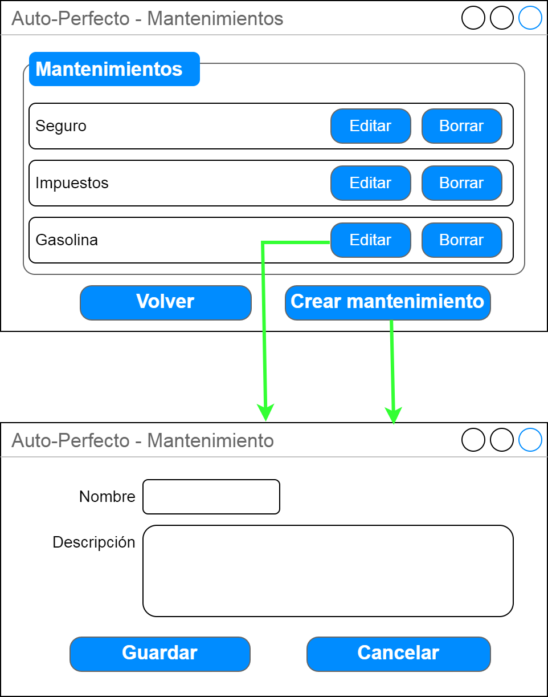
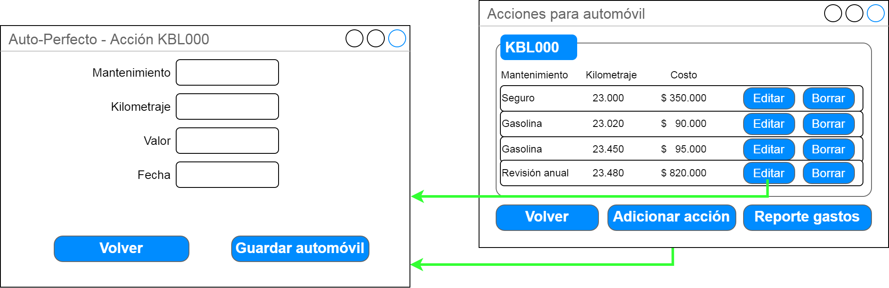

 

## Árbol de navegación y diseño de pantallas

 

### Ventana Principal - Lista de automóviles

Esta es la pantalla principal de la aplicación. Desde acá se pueden ver todos los automóviles y se puede acceder a las demás funcionalidades de la aplicación (listado de mantenimientos y listado de acciones).

 

Esta ventana permite la creación / edición de automóviles:

La eliminación y venta de automóviles está contemplada a través de los botones correspondientes. Al vender un automóvil o desde la ventana de acciones se podrá generar el reporte de gastos del automóvil por año y el valor del kilómetro.

 

### Ventana Principal - Lista de mantenimientos

La lista de mantenimientos muestra todos los mantenimientos registrados en la aplicación. Esta ventana permite además la creación, edición y eliminación de mantenimientos.

### Ventana Principal - Lista de Aacciones

Esta ventana permite ver la lista de acciones de un automóvil. Desde aquí es posible registrar una acción, editarla o eliminarla.

 

