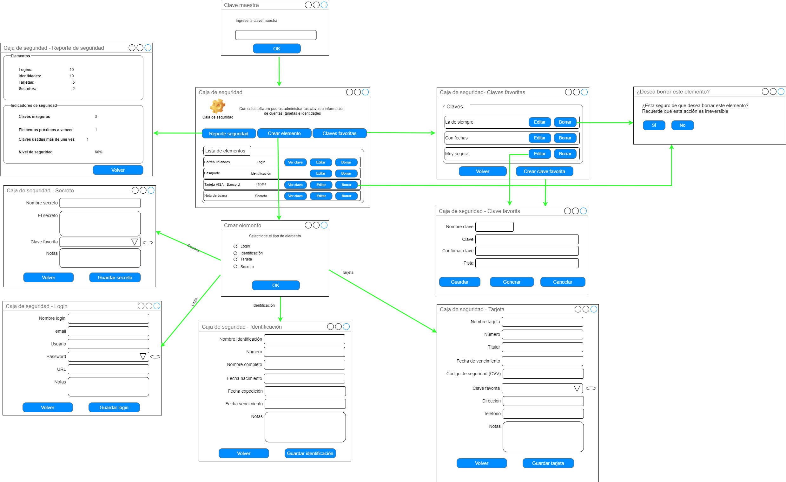
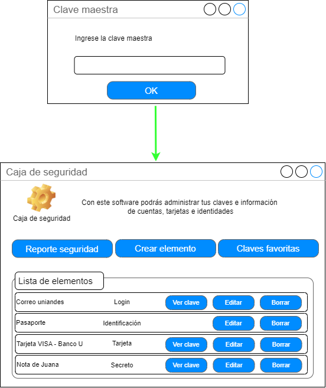
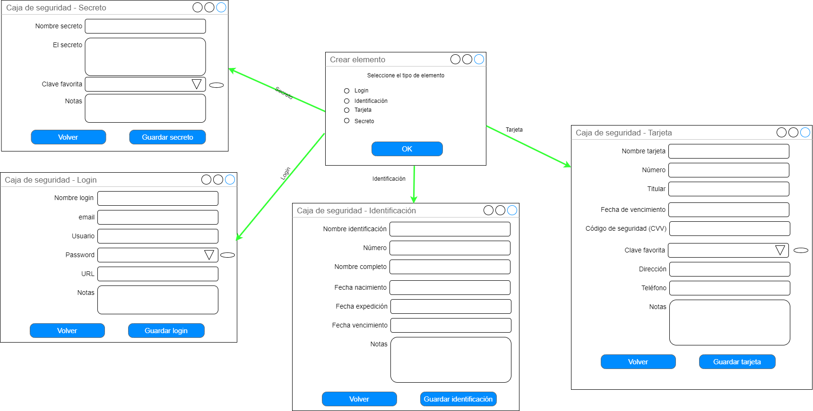
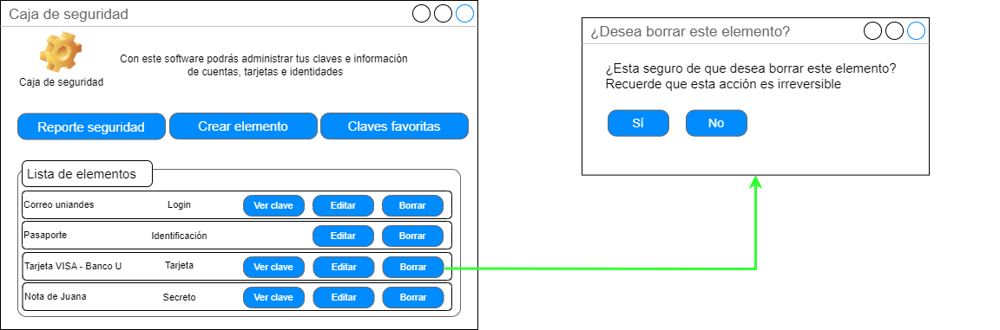
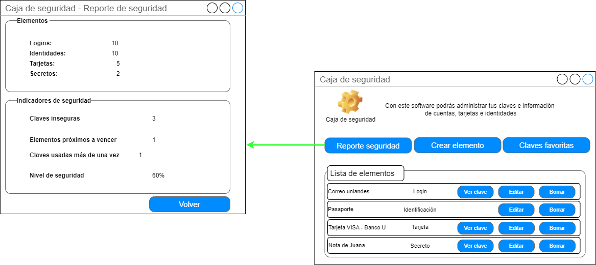
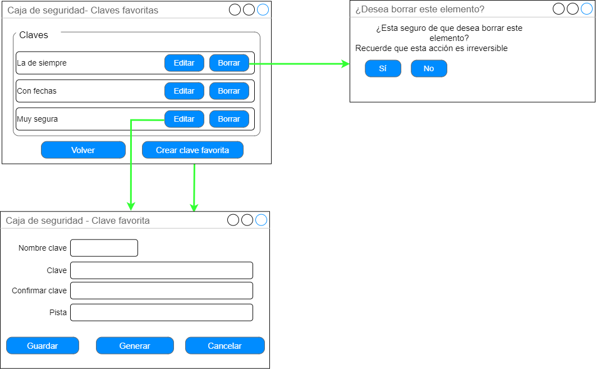

 

## Árbol de navegación y diseño de pantallas

 

### Ventana Principal - Lista de elementos

Esta es la pantalla principal de la aplicación. Se accede luego de introducir de manera correcta la clave maestra, desde acá se pueden ver todos los elementos y se puede acceder a las demás funcionalidades de la aplicación (Claves favoritas, elementos y reporte).

 

La creación de elementos implica preguntar cuál elemento crear, y la edición lleva directamente a la pantalla del elemento a editar:

La eliminación de elementos está contemplada a través de los botones correspondientes.

 

El reporte de seguridad se abre desde la lista de elementos.

 

### Ventana Principal - Claves favoritas

Al elegir el botón Claves Favoritas en la lista de elementos, se pueden ver todas las claves favoritas registradas en la aplicación. Esta ventana permite además la creación, edición y eliminación de tales claves favoritas.

