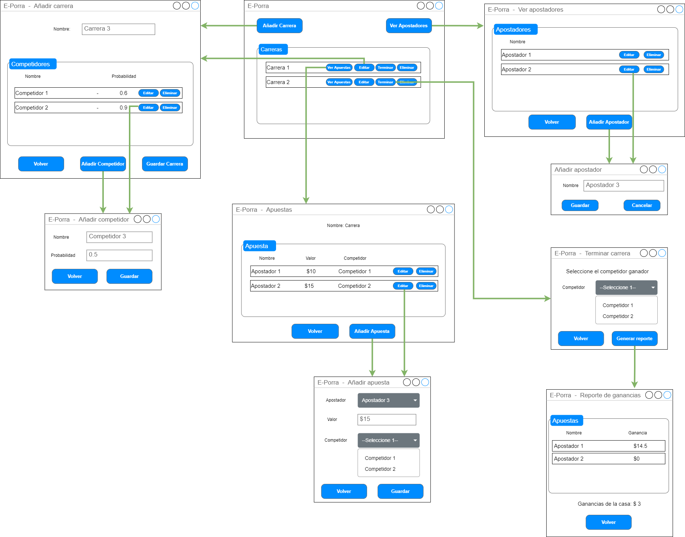

 

## Árbol de navegación y diseño de pantallas

 

### Ventana Principal - Lista de carreras

Esta es la pantalla principal de la aplicación. Desde acá se pueden ver todas las carreras y se puede acceder a las demás funcionalidades de la aplicación (listado de apostadores y listado de apuestas).

 

Esta ventana permite la creación / edición de carreras y competidores:

La eliminación y terminación de carreras está contemplada a través de los botones correspondientes. Al terminar una carrera el usuario administrador podrá generar el reporte de ganancias de la casa y por apostador.

 

### Ventana Principal - Lista de apostadores

La lista de apostadores muestra todos los apostadores registrados en la aplicación. Esta ventana permite además la creación, edición y eliminación de apostadores.

### Ventana Principal - Lista de Apuestas

Esta ventana permite ver la lista de apuestas de una carrera. Desde aquí es posible registrar una apuesta, editarla o eliminarla.

 
