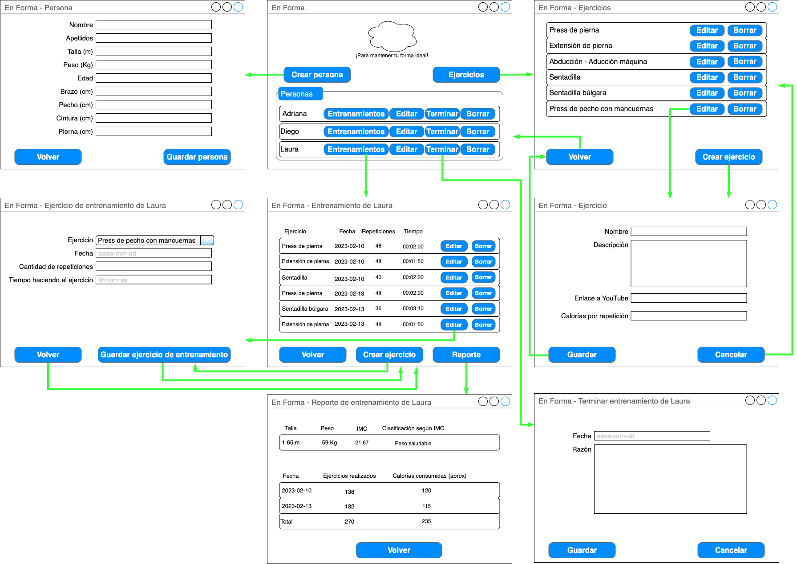
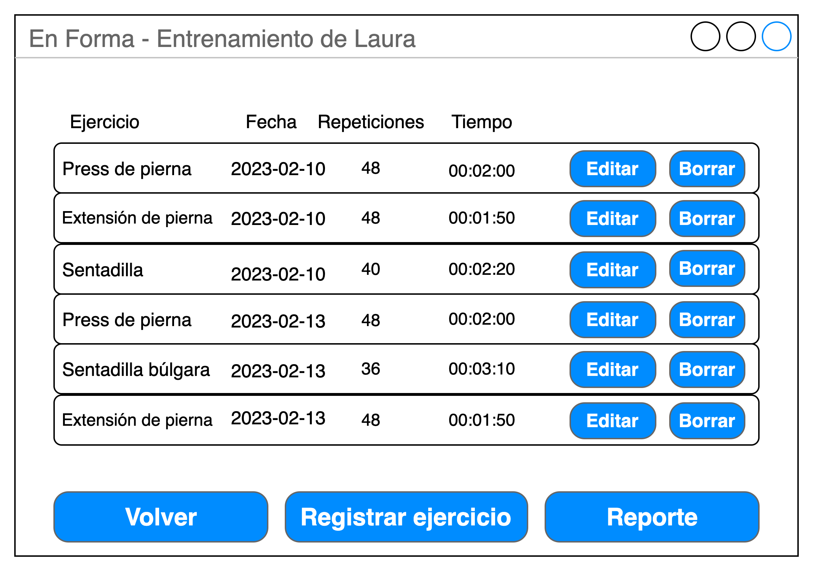

 

## Árbol de navegación y diseño de pantallas

 

### Ventana Principal - Lista de personas

Esta es la pantalla principal de la aplicación. Desde acá se pueden ver todas las personas que se entrenan y se puede acceder a las demás funcionalidades de la aplicación (Personas, ejercicios y entrenamientos).

 

#### Ejercicios
El botón de Ejercicios permite ver la lista de ejercicios disponibles:

 A partir de este listado se puede crear/editar un ejercicio o eliminarlo: 
 

La eliminación de ejercicios se hace a través de los botones correspondientes.

#### Personas
El boton Crear persona de la Ventana principal abre la ventana para crear una persona:

Esta ventanta sirve también para editar los datos de una persona.

#### Entrenamientos

Con el botón entrenamientos se abre la ventana que listas todos los ejercicios que ha realizado la persona.

Desde esta ventana, con el botón Registrar ejercicio se puede registrar un nuevo ejercicio realizado por la persona.

#### Reporte

El botón Reporte de la ventana de Entrenamientos muestra el reporte de los entrenamientos de la persona.

 

