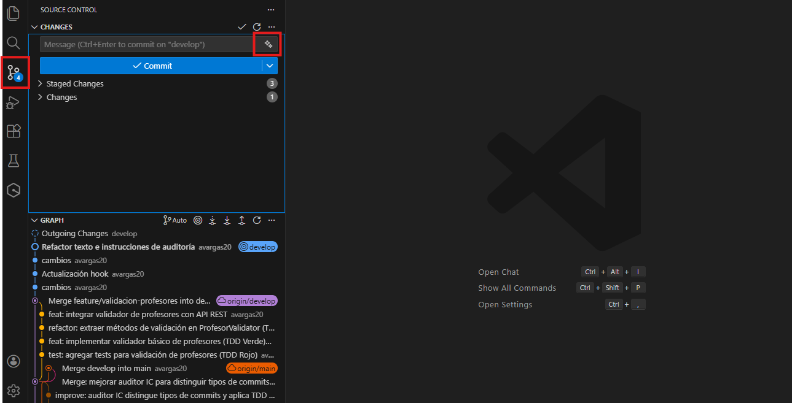

# Sugerencia de mensajes de commit con GitHub Copilot

Esta guía describe cómo **apoyarse en GitHub Copilot desde el IDE para sugerir mensajes de commit**. El uso de esta herramienta no reemplaza el criterio del equipo ni las prácticas de control de versiones definidas para el proyecto.

---

## Pasos previos

* Haber instalado y configurado **GitHub Copilot** en el IDE:
  * [Instructivo PyCharm](MT1PEA-GitHubCopilotPyCharm.pdf)
  * [Instructivo VS Code](MT1PEA-ConfiguracionGitHubCopilotVSCode.pdf)
* Contar con un repositorio del proyecto y cambios preparados para commit (`git add`).

---

## Uso de Copilot para sugerir mensajes de commit

1. **Preparar los cambios**
   * Verificar que los archivos staged correspondan a un solo paso lógico del desarrollo.

2. **Obtener la sugerencia**
   * Acceder a la vista de Git / Source Control del IDE.
   * Ubicar el cursor en el campo del mensaje de commit y utilizar GitHub Copilot.
     
   * Copilot analizará los cambios staged y propondrá un mensaje de commit.

3. **Revisar el mensaje**
   * Confirmar que el mensaje describe claramente el cambio realizado.
   * Ajustar el texto si es necesario antes de confirmar el commit.

4. **Confirmar el commit**
   ```bash
   git commit -m "mensaje revisado por el equipo"

---

## Recomendaciones

* Utilizar Copilot únicamente como **apoyo para redactar el mensaje**.
* No aceptar sugerencias sin una revisión previa.
* Mantener commits pequeños y coherentes con el proceso de desarrollo.

---

El uso de IA es opcional. La calidad y claridad del historial de versiones sigue siendo responsabilidad del equipo.
